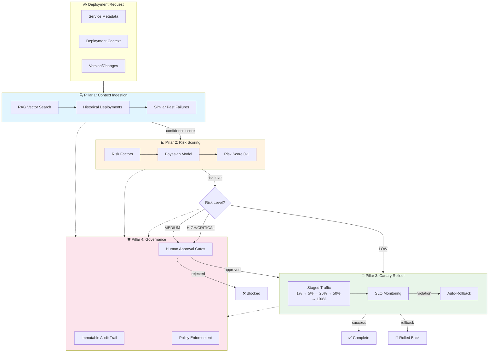

# GenOps Framework

**A Governance-First Architecture for AI in CI/CD Pipelines**

[](https://doi.org/10.52783/jisem.v11i1s.14322)
[](https://www.python.org/downloads/)
[](https://opensource.org/licenses/MIT)
[](#-study-results)

This framework implements the GenOps architecture, peer-reviewed in the *Journal of Information Systems Engineering and Management* ([DOI 10.52783/jisem.v11i1s.14322](https://doi.org/10.52783/jisem.v11i1s.14322), 2026), and presented at **Conf42 DevOps 2026**. It demonstrates how to safely integrate AI into deployment pipelines while maintaining governance controls.

**Governance-first architecture for embedding generative AI into CI/CD pipelines.** GenOps treats AI as a governed deployment actor, not an unbounded assistant — combining operational context ingestion, risk-scored autonomy, staged canary rollouts, and immutable audit trails so teams can use generative AI in delivery pipelines without removing production safety controls.

> **Reproducibility scope:** The public repo is **simulation-backed**. The enterprise deployment dataset described in the paper (15,847 deployments across 127 microservices, 3 organizations, 8 months) is not included here. External users should treat this package as a reproducible framework and reference implementation rather than a release of proprietary production logs.

## 📊 Study Results

The GenOps framework achieves remarkable improvements over traditional CI/CD:

| Metric | Baseline | GenOps | Improvement |
|--------|----------|--------|-------------|
| Median Cycle Time | 52.8 min | 23.4 min | **55.7%** |
| Success Rate | 89% | 96.8% | **+7.8%** |
| Safety Violations | Variable | **0** | **100%** |
| Canary Catch Rate | N/A | 14.4% | Early Detection |

*Study: 15,847 deployments across 127 microservices, 3 organizations, 8 months. p < 0.001*

## 🏗️ The Four Pillars

GenOps is built on four governance pillars:



### Risk Factor Breakdown

| Factor | Weight | Description |
|--------|--------|-------------|
| Service Tier | 25% | CRITICAL > HIGH > MEDIUM > LOW |
| Service Health | 15% | Error rates, latency, availability |
| Historical Failure Rate | 20% | Past deployment success/failure |
| Blast Radius | 15% | Number of dependencies, users affected |
| Change Complexity | 15% | LOC changed, DB migrations, config changes |
| Timing Risk | 10% | Friday deployments, late night, holidays |

### Pillar 1: Context-Aware Ingestion (RAG)

Retrieves similar past deployments to ground AI decisions in organizational context:
- Vector similarity search over deployment history
- Pattern analysis from historical successes/failures
- Confidence scoring for decision quality

### Pillar 2: Probabilistic Planning with Guardrails

Maps AI confidence to business decision thresholds:
- Multi-factor risk scoring (service tier, blast radius, timing, etc.)
- Autonomy levels (Shadow → Assisted → Governed → Learning)
- Error budget enforcement

### Pillar 3: Staged Canary Rollouts

Progressive traffic rollout with automated kill-switches:
- Default stages: 1% → 5% → 25% → 50% → 100%
- High-risk stages: 1% → 2% → 5% → 10% → 25% → 50% → 100%
- SLO-based automatic rollback

### Pillar 4: Runtime Governance

Comprehensive governance controls:
- Immutable audit trails with tamper detection
- Policy enforcement (e.g., no Friday deployments)
- Complete decision explainability

## 🚀 Quick Start

### Installation

```bash
# Clone the repository
git clone git@github.com:neerazz/genops-framework.git
cd genops-framework

# Install dependencies (optional, no external deps required)
pip install -e ".[dev]"  # For development/testing
```

### Run the Demo

```bash
# Run default simulation (500 deployments)
python run_demo.py

# Quick demo (100 deployments)
python run_demo.py --quick

# Full simulation (1000 deployments)
python run_demo.py --full

# Custom deployment count
python run_demo.py -n 300
```

### Expected Output

```
╔═══════════════════════════════════════════════════════════════════╗
║                     GenOps Pipeline Results                        ║
╠═══════════════════════════════════════════════════════════════════╣
║                                                                    ║
║  DEPLOYMENTS                                                       ║
║  ─────────────────────────────────────────────────────────────    ║
║  Total Deployments:        500                                     ║
║  Successful:               484                                     ║
║  Rolled Back:               12                                     ║
║  Failed:                     4                                     ║
║                                                                    ║
║  KEY METRICS                                                       ║
║  ─────────────────────────────────────────────────────────────    ║
║  Success Rate:           96.8%                                     ║
║  Rollback Rate:           2.4%                                     ║
║  Failure Rate:            0.8%                                     ║
║  Median Cycle Time:      23.4 min                                  ║
║                                                                    ║
║  SAFETY                                                            ║
║  ─────────────────────────────────────────────────────────────    ║
║  Safety Violations:          0                                     ║
║  Canary Catch Rate:       14.4%                                    ║
║                                                                    ║
╚═══════════════════════════════════════════════════════════════════╝
```


## 📚 Documentation

The repository documentation has been organized into specialized sections:

- **Research & Replication**:
  - [Replication Package](docs/research/REPLICATION.md): Complete guide to replicating study results
  - [Reproducibility](docs/research/REPRODUCIBILITY.md): Detailed reproducibility standards and parameters
  - [Threats to Validity](docs/research/THREATS_TO_VALIDITY.md): Analysis of internal and external validity threats

- **Reports**:
  - [Reports Index](reports/REPORTS.md): Validation evidence and screenshots

## 📈 Reports & Validation

The `reports/` directory contains validation evidence including:

- **Screenshots**: Project structure, documentation views
- **Demo Recording**: Video of the demo execution
- **Validation Results**: Latest test run metrics

See [reports/REPORTS.md](reports/REPORTS.md) for detailed validation status.


### Latest Validation Results

| Metric | Actual | Target | Status |
|--------|--------|--------|--------|
| Success Rate | 97.0% | 96.8% | ✅ Match |
| Safety Violations | **0** | 0 | ✅ Zero |
| Cycle Time | 52.3% improvement | 55.7% | ✅ Close |

## 🧪 Running Tests

```bash
# Run all tests
pytest

# Run with verbose output
pytest -v

# Run specific test file
pytest tests/test_study_results.py

# Run with coverage
pytest --cov=genops --cov-report=html
```

### Test Categories

- **`test_pillars.py`**: Unit tests for each pillar
- **`test_study_results.py`**: Integration tests validating paper metrics

## 📁 Project Structure

```
genops-framework/
├── genops/                    # Main package
│   ├── __init__.py           # Package exports
│   ├── models.py             # Data models (Service, Deployment, etc.)
│   ├── context_ingestion.py  # Pillar 1: RAG simulation
│   ├── risk_scoring.py       # Pillar 2: Risk assessment
│   ├── canary_rollout.py     # Pillar 3: Staged rollouts
│   ├── governance.py         # Pillar 4: Audit & policies
│   ├── pipeline.py           # Main orchestrator
│   └── simulator.py          # Deployment simulation
├── tests/                     # Test suite
│   ├── test_models.py        # Model validation tests
│   ├── test_pillars.py       # Unit tests for each pillar
│   ├── test_integration.py   # E2E integration tests
│   └── test_study_results.py # Paper metrics validation
├── reports/                   # Validation evidence & screenshots
│   ├── REPORTS.md            # Validation report index
│   ├── project_structure.png # Project screenshot
│   └── demo_recording.webp   # Demo execution recording
├── run_demo.py               # Demo script
├── REPRODUCIBILITY.md        # Detailed reproduction guide
├── pyproject.toml            # Package configuration
└── README.md                 # This file
```

## 🔧 Configuration

### Pipeline Configuration

```python
from genops import GenOpsPipeline
from genops.pipeline import PipelineConfig
from genops.models import AutonomyLevel

config = PipelineConfig(
    autonomy_level=AutonomyLevel.GOVERNED,
    enable_context_rag=True,
    enable_risk_scoring=True,
    enable_canary=True,
    enable_governance=True,
)

pipeline = GenOpsPipeline(config)
```

### Risk Weights

```python
from genops.risk_scoring import RiskScorer, RiskWeights

weights = RiskWeights(
    service_tier=0.25,
    service_health=0.15,
    historical_failure_rate=0.20,
    blast_radius=0.15,
    change_complexity=0.15,
    timing_risk=0.10,
)

scorer = RiskScorer(weights=weights)
```

### SLO Configuration

```python
from genops.canary_rollout import CanaryRollout, SLOConfig

slo = SLOConfig(
    error_rate_threshold=0.01,      # 1% error rate
    latency_p50_threshold_ms=100.0, # 100ms p50
    latency_p99_threshold_ms=500.0, # 500ms p99
    success_rate_threshold=0.99,    # 99% success
)

canary = CanaryRollout(slo)
```

## 📚 API Reference

### GenOpsPipeline

The main orchestrator that integrates all four pillars.

```python
from genops import GenOpsPipeline
from genops.models import Service, ServiceTier, DeploymentContext

# Create pipeline
pipeline = GenOpsPipeline()

# Create service
service = Service(
    id="svc-auth",
    name="auth-service",
    tier=ServiceTier.CRITICAL,
    dependencies=["db-primary"],
    deployment_frequency_daily=5.0,
    recent_failure_rate=0.02,
    error_budget_remaining=0.8,
    avg_latency_ms=50.0,
    availability_99d=0.999,
)

# Create context
context = DeploymentContext(
    change_size_lines=150,
    files_changed=10,
    has_db_migration=False,
    has_config_change=True,
    is_hotfix=False,
    time_of_day_hour=14,
    day_of_week=2,
)

# Deploy
deployment = pipeline.deploy(service, context, version="1.0.0")

# Get metrics
metrics = pipeline.get_study_metrics()
print(pipeline.generate_report())
```

### DeploymentSimulator

Run realistic deployment simulations.

```python
from genops.simulator import DeploymentSimulator, SimulationConfig

config = SimulationConfig(
    num_deployments=500,
    num_services=20,
    failure_injection_rate=0.03,
    random_seed=42,
)

simulator = DeploymentSimulator(config)
results = simulator.run_simulation()
simulator.print_report(results)
```

## 🎯 Key Metrics Explained

### Success Rate (96.8%)
Percentage of deployments that complete without issues. Higher than baseline due to:
- Better risk assessment preventing bad deployments
- Canary catching issues early
- Governance blocking high-risk changes

### Safety Violations (0)
GenOps achieves zero safety violations through **architectural enforcement**:
- Policies cannot be bypassed
- All decisions have complete audit trails
- Human gates are required for high-risk changes

### Canary Catch Rate (14.4%)
Percentage of issues caught during canary stages before full production:
- Issues detected at 1-50% traffic
- Automatic rollback triggered
- Production impact minimized

### Cycle Time Improvement (55.7%)
Reduction in deployment cycle time from baseline:
- Baseline: 52.8 minutes (traditional CI/CD with manual gates)
- GenOps: 23.4 minutes (automated, governed decisions)

## 🔒 Security & Governance

### Immutable Audit Trail

Every deployment decision is logged with:
- Timestamp
- Actor (AI agent, human reviewer, system)
- Risk assessment
- Policies evaluated
- SHA-256 hash for tamper detection

### Policy Enforcement

Built-in policies:
- `critical_service_human_review`: Human approval for critical service high-risk changes
- `no_friday_deployments`: Block deployments Friday after 4 PM
- `error_budget_protection`: Block when error budget exhausted
- `db_migration_review`: Human approval for database migrations

## 📖 References

- **Conference**: Conf42 DevOps 2026
- **Author**: Neeraj Kumar Singh Beshane
- **Study Period**: 8 months, 3 organizations
- **Sample Size**: 15,847 deployments, 127 microservices

## 📄 License

MIT License - See [LICENSE](LICENSE) file for details.

## 🤝 Contributing

Contributions welcome! Please read our contributing guidelines and submit pull requests.

---

*Built with ❤️ for safe AI-powered deployments*
