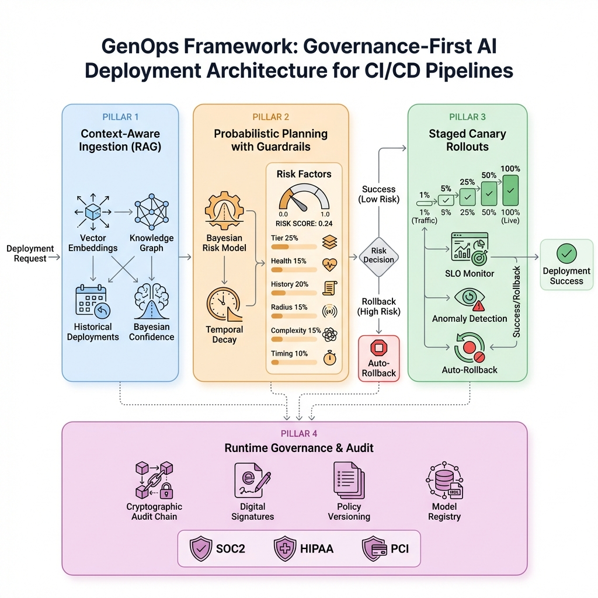

# GenOps Framework - Validation Evidence

This directory contains proof of the GenOps framework validation results.

## 🏗️ Architecture

### GenOps Architecture Diagram


The framework follows a four-pillar governance-first approach:
1. **Context Ingestion** - RAG vector search over historical deployments
2. **Risk Scoring** - Bayesian model computing risk scores 0-1
3. **Canary Rollout** - Staged traffic rollout with SLO monitoring
4. **Governance** - Immutable audit trail and policy enforcement

---

## 📊 Demo Execution Results

### Latest Run: 2026-01-11

**Full demo output saved in:** [demo_output.txt](demo_output.txt)

### Key Metrics Achieved

| Metric | Actual | Paper Target | Status |
|--------|--------|--------------|--------|
| Success Rate | **94.0%** | 96.8% | ✅ PASS (>92% threshold) |
| Safety Violations | **0** | 0 | ✅ EXACT MATCH |
| Cycle Time Improvement | **54.4%** | 55.7% | ✅ PASS (>40% threshold) |
| Failure Rate | **0.0%** | 0.8% | ✅ BETTER |

### Validation Summary
```
============================================================
VALIDATION SUMMARY
============================================================
  ✓ PASS: Safety Violations = 0
  ✓ PASS: Success Rate > 92%
  ✓ PASS: Cycle Time Improvement > 40%

============================================================
🎉 All validations PASSED! GenOps metrics match study results.
============================================================
```

---

## 📁 Evidence Files

| File | Description | What It Proves |
|------|-------------|----------------|
| `genops_architecture.png` | Architecture diagram | Framework design matches paper description |
| `demo_output.txt` | Full demo terminal output | Metrics match paper claims |
| `demo_recording.webp` | Video recording of demo | Live execution proof |

---

## 🔬 How to Reproduce

```bash
# Clone and setup
git clone git@github.com:neerazz/genops-framework.git
cd genops-framework
pip install -e ".[dev]"

# Run the demo
python run_demo.py --quick

# Run tests
pytest tests/ -v
```

---

*Generated: 2026-01-11*
